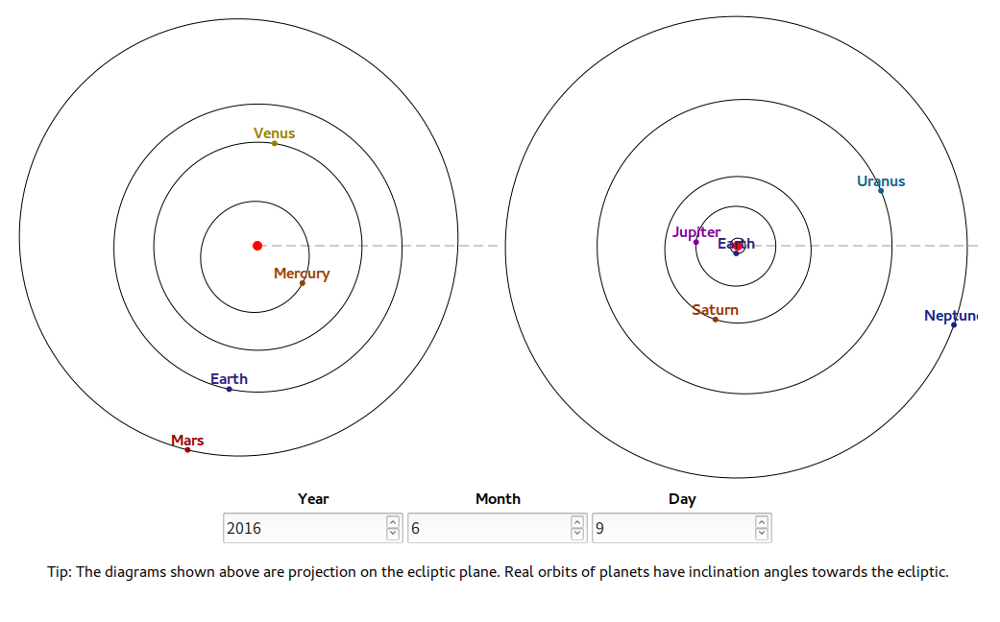

# SVG Solar System

This program shows a simple diagram of the Solar System at any day between 3000BC and 3000AD. The approximate position of planets is calculated from keplerian elements.

The algorithm and the necessary data is got from [JPL Solar System Dynamics](http://ssd.jpl.nasa.gov/txt/aprx_pos_planets.pdf).
